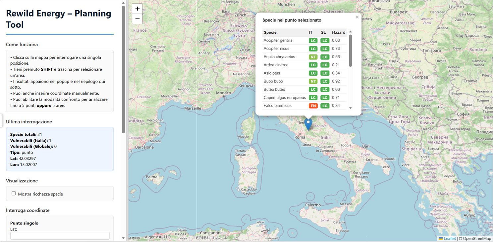

# Rewild Energy – Planning Tool

**Strumento di analisi per la pianificazione di progetti energetici rinnovabili in Italia.**

Questo prototipo dimostrativo è uno strumento di supporto sviluppato da Rewild Energy per mostrare come, attraverso questo strumento, le aziende target possano valutare rapidamente l'impatto potenziale della costruzione di un nuovo impianto di energia rinnovabile sulla fauna selvatica direttamente da browser, senza bisogno di Sistemi Informativi Geografici o competenze tecniche specializzate.

Nel settore energetico, per avviare le procedure di costruzione di nuovi impianti, le aziende devono affrontare procedure autorizzative complesse, come la Valutazione di Impatto Ambientale (VIA) o, nei casi legati a pianificazioni territoriali più ampie, la Valutazione Ambientale Strategica (VAS), e prima di essere approvato un impianto deve dimostrare dettagliatamente i potenziali effetti su ambiente, paesaggio, habitat e specie, e le misure previste per evitare o mitigare i suddetti impatti. Questo strumento è pensato come supporto per condurre analisi preliminari su larga scala, mirando a standardizzare e velocizzare la prima fase di valutazione del potenziale impatto ecologico del nuovo impianto. In seguito alla selezione dei siti utili con l'ausilio del nostro programma, Rewild Energy può assistere le aziende target anche in una seconda fase di esercizio, vantando un ampio team di ecologi e biologi della conservazione, formato da ricercatori e docenti del Dipartimento di Biologia e Biotecnologie Charles Darwin (Università la Sapienza di Roma), con ampia esperienza nel settore, in grado di pianificare e condurre tutti gli ulteriori sopralluoghi finalizzati all'approfondimento del caso specifico, attraverso studi specialistici dedicati mirati a:

- **valutazione dei vincoli ambientali**: Incluse aree protette e siti Natura 2000

- **generazione di report faunistici dettagliati**: Inclusa una checklist di specie, pattern di uso dell'area, etc.

- **indicazione di strategie di mitigazione consigliate**

- **individuazione di aree idonee per la eventuale compensazione ecologica**

 ⚠️ **Avvertenza**: Questo prototipo è puramente dimostrativo, ed è stato intenzionalmente sviluppato su un numero limitato di specie appartenenti alla sola avifauna italiana, con attribuzione di ipotetici valori di rischio delle singole specie (_Hazard_) non affidabili e solamente utili alla dimostrazione delle funzionalità del tool. 
**Si sconsiglia dunque l'uso di questo prototipo per qualsiasi scopo non meramente illustrativo.**

---

## Funzionalità principali

Lo sviluppo di nuovi impianti di energia rinnovabile richiede una valutazione attenta dell'impatto sulla fauna locale, tuttavia i dati relativi alla distribuzione delle specie sul suolo italiano possono essere datati, frammentati, o incorretti. Il nostro Planning Tool semplifica la necessaria fase preliminare di raccolta dati, permettendo all'utuente di selezionare un punto, o un'area, sulla mappa per ottenere immediatamente un elenco delle specie presenti, stato di conservazione a livello italiano e globale, e un indice di rischio (Hazard) impianto-specifico associato (e.g., per impianti eolici, una stima del rischio potenziale di impatto delle singole specie contro la turbina eolica). 
La presenza potenziale delle specie viene stimata tramite modelli di idoneità dell’habitat aggiornati ottimizzati per l’Italia, e si basa su dati geo-spaziali ad elevata risoluzione.

### 1. Interrogazione interattiva della mappa
Il nostro strumento, completamente _stand-alone_, permette di analizzare la presenza di specie sul territorio nazionale attraverso:

- **Interrogazione di un punto:** Un semplice click su una posizione di interesse permette di analizzarne la comunità locale (risoluzione 1km x 1km)
- **Interrogazione di un'area:** Tenendo premuto il tasto SHIFT della tastiera e trascinando, è possibile disegnare una bounding box che riporti informazioni di aree più ampie
- **Inserimento manuale di coordinate:** Per interrogare punti o aree di interesse, è anche possibile inserire manualmente le coordinate del singolo punto, o i vertici dell'area di interesse.

  

Per ogni interrogazione il tool restituisce:
- **Elenco completo delle specie presenti** nel punto o nell'area selezionata
- **Categoria Lista Rossa italiana** (LC: Minima Preoccupazione, NT: Vicina alla minaccia, VU: Vulnerabile, EN:Minacciata, CR: Criticamente minacciata, DD: Dati insufficienti)
- **Categoria Lista Rossa globale IUCN**
- **Indice Hazard** per ciascuna specie, ovvero una stima del rischio associato alla presenza della specie nel sito per l'impianto in questione.

### 2. Mappa di ricchezza delle specie
Al fine di facilitare un'interrogazione preliminare e visiva della mappa, il Planning Tool prevede la possibilità di impostare un overlay visivo sulla mappa del territorio nazionale che mostri la **ricchezza di specie**. E' attivabile/disattivabile con un singolo click. 

⚠️ **Avvertenza**: Nella fase attuale, la visualizzazione dell'overlay di ricchezza di specie può richiedere del tempo per il suo primo caricamento. Tuttavia questa, ed ulteriori problematiche legate alla limitata capacità computazionale dettata dall'esecuzione del programma su browser locale, saranno completamente ovviate una volta che il programma verrà finalizzato e hostato su un web-server dedicato.

### 3. Modalità confronto
La modalità confronto permette l'analisi comparativa di **fino a 5 siti** (punti o aree), in parallelo, al fine di facilitare la comparazione di vantaggi e svantaggi di potenziali siti d'elezione. Un pannello dedicato offre un riepilogo delle specie presenti, il loro stato di conservazione, e una comparazione di specie vulnerabili ed Hazard medio per ciascun sito. Lo stesso strumento, offre un'identificazione automatica del sito migliore, basata sui suddetti parametri, per il loro potenziale impatto sulla biodiversità.

### 4. Esportazione dati
Sia per quanto riguarda i dati associati alle singole interrogazioni, sia per le interrogazioni effettuate in modalità confronto, è possibile scaricare dei file in formato CSV (semicolon-separated, per garantirne la compatibilità con Excel in italiano), con tutti i metadati necessari.

---

## Come utilizzare il Planning Tool (Windows):
Il nostro strumento non richiede alcuna installazione o software esterno, e la sua installazione è immediata e di facile utilizzo. Basterà:
  1. Scaricare il pacchetto del programma dal drive dedicato [Google Drive](https://zenodo.org/record/XXXXXXX) (formato `.zip`).
  2. Estrarre il contenuto della cartella zip in una cartella a piacere, sul proprio computer.
  3. Aprire la cartella estratta ed avviare `RewildEnergy.exe` con un semplice doppio-click.
  4. Il browser si aprirà automaticamente, ed il tool sarà immediatamente pronto all'uso, anche in assenza di connessione internet.

##  Dati

Le distribuzioni delle specie sono basate su dati raster in formato GeoTIFF (EPSG:4326), con una copertura completa del territorio italiano [Lumbierres et al., 2022](https://doi.org/10.1038/s41597-022-01838-w).

I dati sullo stato di conservazione derivano dalla Lista Rossa IUCN  [IUCN, 2026](https://www.iucnredlist.org/). 

L'indice di Hazard, una volta finalizzato lo strumento, deriverà invece da elaborazioni interne di Rewild Energy.

---

##  Licenza

Nessuna Licenza

##  Contatti

📧 [alessandra.dalessio@uniroma1.it](mailto:alessandra.dalessio@uniroma1.it) 
📧 [davide.mirante@uniroma1.it](mailto:davide.mirante@uniroma1.it)
